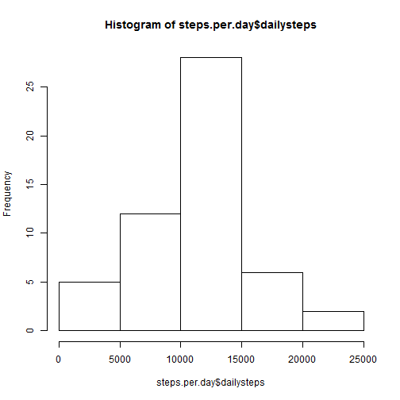
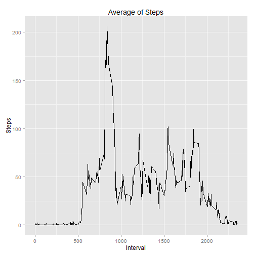
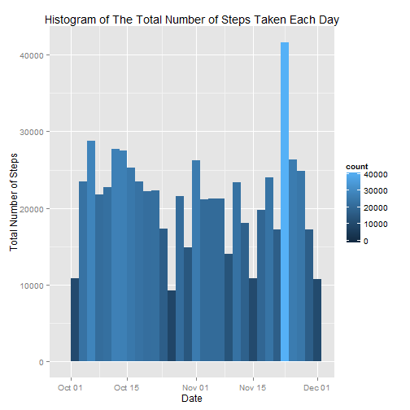
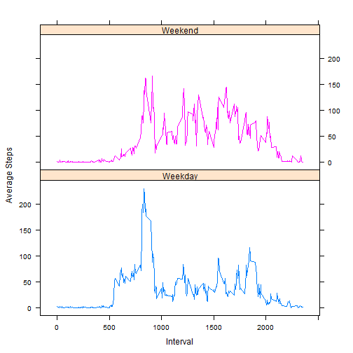

[**Online RMarkdown source code**](https://github.com/omerkara/RepData_PeerAssessment1/blob/master/PA1_template.Rmd)  
[**Online Markdown version on Github pages**](https://github.com/omerkara/RepData_PeerAssessment1/blob/master/PA1_template.md)  
[**Online HTML version on Github pages**](https://github.com/omerkara/RepData_PeerAssessment1/blob/master/PA1_template.html)

## Loading and preprocessing the data

1. Loading the data

```r
# The reproducible way to download/unzip the data file.
# If the data files are already in the current WD, you can skip this step. 
fileName <- "activity.csv"
fileNameZip <- "repdata-data-activity.zip"
fileDest <- paste("./", fileName, sep = "")
fileDestZip <- paste("./", fileNameZip, sep = "")
fileURL <- "https://d396qusza40orc.cloudfront.net/repdata%2Fdata%2Factivity.zip"

if (file.exists(fileName)) {
    message("'activity.csv' already exists in the current WD")
    } else {
        if (file.exists(fileNameZip)) {
            message("Unzipping the data file into 'activity.csv' in the current WD")
            unzip(fileNameZip, fileName)
            } else { 
                message("Downloading and unzipping the data file into 'activity.csv' in the created './data' directory")
                if (!file.exists("./data")) {
                    dir.create("./data")  ## Creates ./data for data files
                }
                setwd("./data") ## Setting up the working directory.
                download.file(fileURL, fileDestZip, method = "auto")
                unzip(fileNameZip, fileName)
                }
        }

#Laoding
activity <- read.csv("./activity.csv", header=TRUE, na.strings = "NA", 
                     colClasses = c("numeric", "Date", "numeric"), 
                     comment.char="")
```


2. Processing/transforming data into a format suitable to anlayze.

```r
# Processing the date from character class to POSIXlt class incase we need it.. 
activity$date.POSIXlt <- strptime(activity$date, format = "%Y-%m-%d")

# Printing a sample of data to understand the data.
head(activity)
```

```
##   steps       date interval date.POSIXlt
## 1    NA 2012-10-01        0   2012-10-01
## 2    NA 2012-10-01        5   2012-10-01
## 3    NA 2012-10-01       10   2012-10-01
## 4    NA 2012-10-01       15   2012-10-01
## 5    NA 2012-10-01       20   2012-10-01
## 6    NA 2012-10-01       25   2012-10-01
```

```r
tail(activity)
```

```
##       steps       date interval date.POSIXlt
## 17563    NA 2012-11-30     2330   2012-11-30
## 17564    NA 2012-11-30     2335   2012-11-30
## 17565    NA 2012-11-30     2340   2012-11-30
## 17566    NA 2012-11-30     2345   2012-11-30
## 17567    NA 2012-11-30     2350   2012-11-30
## 17568    NA 2012-11-30     2355   2012-11-30
```

```r
summary(activity)
```

```
##      steps            date               interval   
##  Min.   :  0.0   Min.   :2012-10-01   Min.   :   0  
##  1st Qu.:  0.0   1st Qu.:2012-10-16   1st Qu.: 589  
##  Median :  0.0   Median :2012-10-31   Median :1178  
##  Mean   : 37.4   Mean   :2012-10-31   Mean   :1178  
##  3rd Qu.: 12.0   3rd Qu.:2012-11-15   3rd Qu.:1766  
##  Max.   :806.0   Max.   :2012-11-30   Max.   :2355  
##  NA's   :2304                                       
##   date.POSIXlt                
##  Min.   :2012-10-01 00:00:00  
##  1st Qu.:2012-10-16 00:00:00  
##  Median :2012-10-31 00:00:00  
##  Mean   :2012-10-31 00:25:34  
##  3rd Qu.:2012-11-15 00:00:00  
##  Max.   :2012-11-30 00:00:00  
## 
```

```r
str(activity)
```

```
## 'data.frame':	17568 obs. of  4 variables:
##  $ steps       : num  NA NA NA NA NA NA NA NA NA NA ...
##  $ date        : Date, format: "2012-10-01" "2012-10-01" ...
##  $ interval    : num  0 5 10 15 20 25 30 35 40 45 ...
##  $ date.POSIXlt: POSIXlt, format: "2012-10-01" "2012-10-01" ...
```

## What is the mean total number of steps taken per day?

1. Histogram of the total number of steps taken each day

```r
#install.packages("plyr")
library(plyr)
steps.per.day <- ddply(activity, c("date"), summarize, dailysteps = sum(steps))

hist(steps.per.day$dailysteps) ## Question is a bit vague so this histogram shows the distribution of the total number of steps across days.
```

 

2. **Mean** and **median** total number of steps taken per day

```r
mean(tapply(activity$steps, activity$date, sum, na.rm = TRUE)) ## NA's are considered as "0"
```

```
## [1] 9354
```

```r
median(tapply(activity$steps, activity$date, sum, na.rm = TRUE)) ## NA's are considered as "0"
```

```
## [1] 10395
```

```r
#mean(steps.per.day$dailysteps, na.rm = TRUE) ## NA's are removed and not considered as "0" so the result is different from above.
#median(steps.per.day$dailysteps, na.rm = TRUE) ## NA's are removed and not considered as "0" so the result is different from above.
```

## What is the average daily activity pattern?

1. Plot of interval vs average Steps

```r
library(ggplot2)
average.steps <- data.frame(cbind(activity$interval, 
                                  tapply(activity$steps, activity$interval, 
                                         mean, na.rm = TRUE)))

colnames(average.steps) <- c("Interval", "Steps")

q <- ggplot(data = average.steps, aes(x = Interval, y = Steps)) + geom_line()
print(q + ggtitle("Average of Steps"))
```

 

2. Interval for maximum average steps

```r
max.int <- average.steps$Interval[which.max(average.steps$Steps)]

strftime(as.POSIXct(Sys.Date()) + as.difftime(max.int%/%100, units = "hours") +
             as.difftime(max.int%%100, units = "mins"), "%r", tz = "UTC")
```

```
## [1] "08:35:00 AM"
```

## Imputing missing values

1. Total number of rows with NAs

```r
nrow(activity[is.na(activity$steps),]) ## Or sum(is.na(activity))
```

```
## [1] 2304
```

2. Use the mean for 5-minute interval, to replace the missing values.  
*I will use the means for the 5-minute intervals as fillers for missing
values.*

3. A new dataset that is equal to the original dataset but with the missing data filled in.

```r
activity[is.na(activity[, 1]), 1] <- average.steps[is.na(activity[, 1]), 2]

#OR

activity.filled <- activity
for (i in seq(nrow(activity))) {
    if (is.na(activity$steps[i])) {
        activity.filled$steps[i] <- mean(activity$steps[activity$interval == activity$interval[i]], na.rm = TRUE)
    }
}
```

4. Histogram of the total number of steps taken each day (Filled Data)

```r
#install.packages("ggplot2")
library(ggplot2)
q <- qplot(date, weight = steps, data = activity, geom = "histogram", 
           binwidth = 0.5, 
           main = "Histogram of The Total Number of Steps Taken Each Day",
           main2 = "Filled Activity Data",
           ylab = "Total Number of Steps", xlab = "Date") + 
    geom_histogram(aes(fill = ..count..))

print(q)
```

```
## stat_bin: binwidth defaulted to range/30. Use 'binwidth = x' to adjust this.
```

 

```r
mean(tapply(activity$steps, activity$date, sum, na.rm = TRUE))
```

```
## [1] 10766
```

```r
median(tapply(activity$steps, activity$date, sum, na.rm = TRUE))
```

```
## [1] 10766
```
From the graph, it is clearly see that the number of steps for the first and the last days of the data is no longer missing since NAs are filled. Most days in the middle of data's time span (end of October - begining of November) have an increased number of steps, since the NAs have been replaced by the 5-minute interval mean, so increase in the mean of total number of steps taken in each day.

## Are there differences in activity patterns between weekdays and weekends?

1. Weekday or weekend day.

```r
activity$day <- as.factor(ifelse(weekdays(activity$date) 
                                 %in% c("Saturday","Sunday"),
                                 "Weekend", "Weekday"))
```

2. Panel plot for average steps for intervals and weekend/weekdays

```r
#install.packages("lattice")
library(lattice)
xyplot(steps ~ interval | day, data = aggregate(steps ~ interval + day,
                                                activity, FUN = mean),
       layout = c(1, 2), type = "l", group=day, ylab = "Average Steps", 
       xlab = "Interval")
```

 


